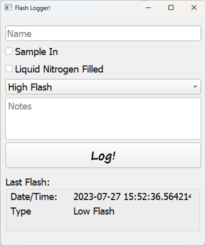

# FlashLogger
PyJEM script to log the gun conditions following a flash of the cold FEG gun and save files to a csv file.

**Not yet tested live on a microscope**, but intended for a JEOL F200 STEM.

## Simple UI:

TEM user inputs name, checks the boxes if the conditions have been met, the type of flash (low or high) and any notes to be taken at the same time (eg any errors or user notes)

TODO save Dark Current?
TODO: save vacuum values

