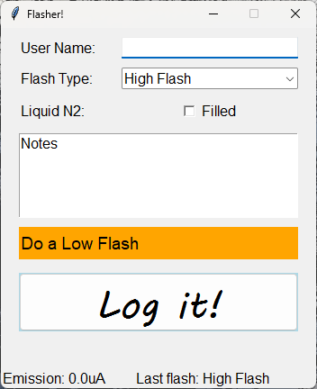

# FlashLogger
PyJEM script to log the gun conditions following a flash of the cold FEG gun and save files to a csv file.

**Not yet tested live on a microscope**, but intended for a JEOL F200 STEM.

## Simple UI:

TEM user inputs name, checks the boxes if the conditions have been met, the type of flash (low or high) and any notes to be taken at the same time (eg any errors or user notes)

## install instructions 
instructions: import "'run logger.xml'' in windows tsak scheduler and change the user name to the user name or group you want to use. 
Move the rest of the files in tkinter folder to a new folder: C:\Flasher\  then log out and log in and the flasher programme should run automagically. 
after 30s the task bar should update and show the current emission folder 
**NB** can't be closed from cross incorner - have to use task manager to force stop (task may be called python.exe) 

TODO how to save Dark Current?
TODO: how to save vacuum values
TODO: check firt run is working properly - got an error that the file doesn't exist

